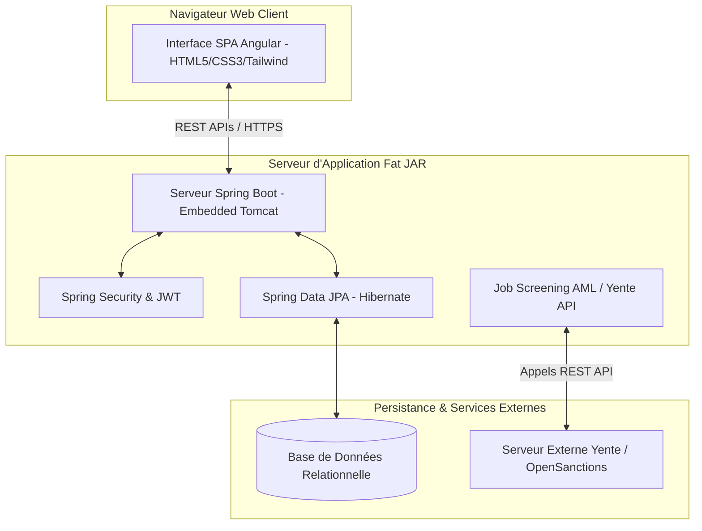

# CAHIER DES CHARGES - PLATEFORME DE GESTION DE CABINET D'AVOCATS "SI-LÉGALE"

Ce document sert de référence fonctionnelle et technique pour la plateforme **SI-LÉGALE** (Système d'Information Légal), développée pour la gestion moderne, conforme et sécurisée des cabinets d'avocats. Il décrit le périmètre fonctionnel, l'architecture technique, l'ergonomie responsive ainsi que les protocoles de conformité financière intégrés à l'application.

---

## 1. Présentation Générale du Projet

Le projet **SI-LÉGALE** est une application web d'entreprise conçue spécifiquement pour structurer l'activité quotidienne des cabinets juridiques. L'application résout les problématiques d'organisation des dossiers, de suivi d'audience, de collaboration interne, et intègre des contrôles stricts de **conformité réglementaire (AML/KYC)** grâce au screening automatique des clients.

### Objectifs Clés
- **Centralisation du CRM Juridique** : Fiche client complète regroupant les personnes physiques, morales, associations et institutions.
- **Gestion Administrative des Dossiers** : Suivi rigoureux de l'état d'avancement des affaires judiciaires et juridiques.
- **Agenda Judiciaire Partagé** : Planification des audiences, expertises et rendez-vous clients avec des rappels dynamiques.
- **Sécurité et Conformité AML/KYC** : Détection proactive des personnes politiquement exposées (PPE) ou sous sanctions financières internationales.
- **Simplicité de Déploiement** : Unification du frontend et du backend au sein d'un seul exécutable autonome ("Fat JAR").

---

## 2. Périmètre Fonctionnel

L'application est divisée en plusieurs modules interactifs accessibles depuis le tableau de bord principal.

### 2.1. Tableau de Bord et Alertes (Dashboard)
- **Indicateurs clés (KPI)** : Visualisation du nombre de dossiers actifs, d'alertes non traitées, de rendez-vous à venir et du nombre total de clients enregistrés.
- **Zone d'alerte et de conformité** : Notification en temps réel en cas de suspicion ou de "Match" détecté lors du filtrage anti-blanchiment (AML). 
- **Raccourcis d'actions rapides** : Boutons de création rapide de client, de nouveau dossier ou d'accès direct au calendrier.

### 2.2. Gestion de la Relation Client (CRM & KYC)
La plateforme gère quatre types d'entités juridiques distinctes :
1. **Personnes Physiques** (Clients individuels).
2. **Personnes Morales** (Sociétés, SAS, SARL, etc.).
3. **Associations**.
4. **Institutions** (Établissements publics, banques, etc.).

Chaque fiche client regroupe :
- **Points de contact** secondaires (responsables juridiques, comptables).
- **Bénéficiaires Effectifs (UBO)** : Enregistrement obligatoire du pourcentage de détention et du rôle des bénéficiaires finaux (requis pour la conformité réglementaire).
- **Coffre-fort Documentaire KYC** : Stockage sécurisé des pièces d'identité, statuts d'entreprise, Kbis, et justificatifs de domicile.

### 2.3. Gestion des Dossiers (Matter/Case Management)
- **Identification** : Titre, numéro de référence interne unique et date d'ouverture.
- **Classification** : Association à un client, à un domaine juridique (Droit Pénal, Droit du Travail, Droit des Sociétés, etc.) et à un niveau de priorité (Basse, Moyenne, Haute, Urgente).
- **Journal d'activité** : Suivi temporel de toutes les actions menées sur le dossier (courriers envoyés, pièces déposées, rendez-vous passés).
- **Tâches de préparation** : Liste des devoirs internes associés au dossier, avec assignation de collaborateurs, états d'avancement (À faire, En cours, Terminé) et historique des modifications.

### 2.4. Calendrier Judiciaire & Agenda
L'agenda intègre des affichages dynamiques (journée et semaine) facilitant la coordination :
- **Suivi d'audiences et rendez-vous** : Création d'événements caractérisés par une date, un lieu (ex. Tribunal Judiciaire), des participants du cabinet et une catégorie d'événement (Audience, Réunion client, Expertise).
- **Grille responsive et interactive** : Adaptation automatique à la largeur de l'écran avec possibilité d'éditer ou de supprimer rapidement un événement directement depuis le calendrier.

### 2.5. Contrôle Anti-Blanchiment (AML Compliance)
Ce module est l'un des piliers stratégiques de la plateforme :
- **Screening automatisé** : Intégration en arrière-plan d'une routine de vérification des sanctions internationales et PPE (via le service API OpenSanctions/Yente).
- **Évaluation du Risque** : Attribution d'un statut AML au client (ex. *Clean*, *Suspicious*, *Approved*).
- **Gestion des Matchs** : Analyse des concordances trouvées, avec possibilité pour l'avocat responsable de valider le client (Faux positif) ou de rejeter l'accès.

### 2.6. Notes Privées & Observations Confidentielles
- **Annotation de stratégie** : Rédaction libre de notes stratégiques rattachées à un dossier.
- **Classification par couleur** : Attributs colorimétriques selon l'importance de la note pour une lecture visuelle simplifiée.
- **Sécurité** : Les notes possèdent un statut privé garantissant que seuls les professionnels habilités du cabinet peuvent en consulter le contenu.

### 2.7. Administration du Système
- **Gestion des Utilisateurs** : Création et désactivation de comptes pour les membres du cabinet, avec attribution de rôles métiers (Administrateur, Avocat, Collaborateur, Secrétariat).
- **Listes de référence** : Configuration des données d'affichage (domaines juridiques, statuts de dossiers, priorités, catégories de tâches et types d'événements).
- **Journal d'Audit** : Historique global et inaltérable des actions utilisateurs à des fins de traçabilité.

---

## 3. Architecture Technique

La plateforme s'appuie sur des technologies modernes assurant performance, sécurité et maintenabilité.



### 3.1. Technologies Employées
- **Frontend** :
  - **Framework** : Angular v18+ (Composants autonomes, programmation réactive avec RxJS).
  - **Design/Design System** : TailwindCSS pour un rendu esthétique moderne et une personnalisation simplifiée.
  - **Icônes** : Tracés SVG natifs légers et ultra-nets.
- **Backend** :
  - **Framework** : Spring Boot 3+ (Java 17+).
  - **Accès aux données** : Spring Data JPA, Hibernate.
  - **Sécurité** : Filtres Spring Security et contrôle d'accès.
  - **Tâches planifiées** : `@EnableScheduling` pour l'exécution automatique des jobs de vérification AML.
- **Base de Données** :
  - Configurable pour fonctionner en mode léger embarqué (H2 pour le développement) ou robuste de production (PostgreSQL / MySQL / MariaDB).

### 3.2. Mode d'Empaquetage & Déploiement Unique (Fat JAR)
Pour éliminer la complexité classique de déploiement (serveurs web séparés, configuration CORS complexe), le projet compile l'application frontend Angular sous forme d'actifs statiques optimisés directement intégrés dans le répertoire `src/main/resources/static` du projet Spring Boot.
- **Commande unique de démarrage** : 
  ```bash
  java -jar avo-maitrise-app.jar
  ```
- **Avantages** : Zéro problème de configuration CORS, hébergement complet sur un port unique sécurisé, simplicité d'installation sur les serveurs clients (Windows Server, Linux/Docker).

---

## 4. Design & Ergonomie Responsive (Mobile First)

Le design de l'application a été conçu selon des critères esthétiques premium.

- **Thématique Visuelle** : Combinaisons de fonds clairs et épurés, avec des accents de couleurs harmonieux (Indigo, Cyan, Vert émeraude, Rouge cerise) évitant les couleurs primaires basiques pour un rendu haut de gamme.
- **Navigation Flexible** : Un panneau latéral de navigation ("Sidebar") escamotable se replie automatiquement en mode tiroir sur mobile et tablette. Un en-tête avec bouton menu ("Hamburger") fait son apparition sur les écrans étroits pour maximiser l'espace de travail.
- **Contrôles Tactiles (Touchscreen Friendly)** : Les boutons d'action (comme les modifications de dossiers ou suppression d'audiences) qui s'affichaient uniquement au survol de la souris sur ordinateur sont programmés pour rester visibles statiquement sur les tablettes et smartphones.
- **Tableaux et Grilles Adaptatives** :
  - Les onglets de formulaires et de détails de dossiers se transforment en bandeaux horizontaux défilables au doigt.
  - Les grilles d'agenda complexes et hebdomadaires bénéficient d'un défilement horizontal fluide sur les smartphones, empêchant les colonnes horaires de s'écraser.
  - Les formulaires complexes s'empilent verticalement sur les petits écrans avec des boutons élargis pour une saisie tactile sans erreur.

---

## 5. Livrables et Installation

Le projet complet est livré prêt à l'emploi et comprend les ressources suivantes :
1. **Code source** complet (séparé en sous-modules `front/` et `back/` pour la maintenance).
2. **JAR Exécutable de Production** regroupant les deux composants.
3. **Scripts de build automatique** (`maven` et `npm`) permettant de mettre à jour le projet en une commande.
4. **Documentation d'installation** pour paramétrer la connexion au serveur AML Yente.
