# Database Schema (MCD) - Avo-Maitrise

This document contains the Entity-Relationship (ER) diagram representing the conceptual database model (MCD) for the Avo-Maitrise application.

## Conceptual Diagram (Mermaid)

```mermaid
erDiagram
    app_users {
        Long id PK
        String email
        String username
        String first_name
        String last_name
        String role
        Boolean is_partner
        Boolean is_active
        Timestamp created_at
        String avatar_url
    }

    clients {
        Long id PK
        String email
        String telephone
        String adresse
        String pays
        String client_status
        String secteur_activite FK
        Timestamp created_at
    }

    personnes_physiques {
        Long id PK, FK
        String nom
        String prenom
        String nationalite
        String cin
        Date date_naissance
    }

    clients_moraux {
        Long id PK, FK
        String nom_commercial
        String forme_juridique
        String numero_registre_commerce
        String numero_id_fiscal
        String nom_representant_legal
        String prenom_representant_legal
        String nationalite_representant_legal
        String cin_representant_legal
        Date date_naissance_representant_legal
    }

    associations {
        Long id PK, FK
        String nom
        String numero_registre_national
        String numero_id_fiscal
        String nom_representant_legal
        String prenom_representant_legal
        String nationalite_representant_legal
        String cin_representant_legal
        Date date_naissance_representant_legal
    }

    institutions {
        Long id PK, FK
        String nom
        String numero_registre_national
        String numero_id_fiscal
        String nom_representant_legal
        String prenom_representant_legal
        String nationalite_representant_legal
        String cin_representant_legal
        Date date_naissance_representant_legal
    }

    ubos {
        Long id PK
        String full_name
        String nationality
        String role_in_company
        Double percentage_of_ownership
        Long client_id FK
        String aml_analysis_status
    }

    contact_points {
        Long id PK
        String nom
        String prenom
        String email
        String telephone
        String occupation
        Long client_id FK
    }

    dossiers {
        Long id PK
        String reference_interne
        String titre
        String description
        Long client_id FK
        Long responsable_id FK
        String domaine_juridique FK
        String priorite_id FK
        String statut_id FK
        Timestamp date_ouverture
        Timestamp date_cloture
        Double budget_estime
        Double taux_horaire_applique
        String methode_facturation
        Timestamp updated_at
    }

    dossier_contacts {
        Long id PK
        Long dossier_id FK
        String civilite
        String nom
        String prenom
        String entreprise
        String email
        String telephone_fixe
        String telephone_mobile
        String adresse
        String num_toque
        String site_web
        String pays
        String profession
        String observation
        String notes
        Timestamp created_at
        Timestamp updated_at
    }

    notes {
        Long id PK
        Long dossier_id FK
        Long auteur_id FK
        String title
        String description
        String category_id FK
        Timestamp created_at
        Timestamp updated_at
    }

    tasks {
        Long id PK
        Long dossier_id FK
        String titre
        String description
        String category_id FK
        String status_id FK
        String priorite
        Timestamp date_echeance
        Boolean is_completed
        Timestamp created_at
        Long created_by_id FK
        Integer estimated_time_minutes
    }

    documents {
        Long id PK
        String nom_fichier
        String type_document
        String title
        String name
        String label
        String description
        String tags
        String filename
        String url_stockage
        Timestamp date_upload
        Boolean est_valide
        Blob file_data
        Long client_id FK
        Long dossier_id FK
    }

    form_config {
        String id PK
        String type
        String target_client_type
        String name
        String title
        String description
        Timestamp creation_date
        Timestamp last_update_date
    }

    field_config {
        String id PK
        String name
        String type
        String label
        Boolean required
        String error_message
        String placeholder
        String form_config_id FK
    }

    field_option {
        String id PK
        String name
        String value
        String field_config_id FK
    }

    diligence_form_result {
        String id PK
        String form_config_id FK
        Long client_id FK
        Timestamp creation_date
        Timestamp last_update_date
    }

    field_result {
        Long id PK
        String field_config_id FK
        String field_option_id FK
        String value
        String diligence_form_result_id FK
    }

    client_diligence_status {
        String id PK
        Long client_id FK
        String form_config_id FK
        String status
        String result_id
        Timestamp creation_date
        Timestamp last_update_date
        Boolean enabled
    }

    screening_execution {
        Long id PK
        Long client_id FK
        Long ubo_id FK
        Json raw_response
        Timestamp created_at
        String execution_message
        String status
    }

    screening_matches {
        Long id PK
        Long screening_execution_id FK
        Long client_id FK
        Long ubo_id FK
        String yente_id
        Double score
        String target_name
        Json raw_response
        Timestamp created_at
        String match_reason
        String status
        String reviewer_comment
        Timestamp reviewed_at
        String reviewed_by
        String yente_last_update
    }

    secteurs_activite {
        String code PK
        String libelle
        Integer ordre_affichage
        Boolean actif
        Timestamp created_at
    }

    domaines_juridiques {
        String code PK
        String label
        String color
        Boolean active
        Integer display_order
        Timestamp created_at
    }

    statuts_dossier {
        String code PK
        String label
        String color
        Boolean active
        Integer display_order
        Timestamp created_at
    }

    dossiers_priorites {
        String code PK
        String label
        String color
        Boolean active
        Integer display_order
        Timestamp created_at
    }

    note_categories {
        String code PK
        String label
        String color
        Boolean active
        Integer display_order
        Timestamp created_at
    }

    task_categories {
        String code PK
        String libelle
        String couleur
        String icone
        Boolean actif
        Timestamp created_at
    }

    task_statuses {
        String code PK
        String libelle
        Integer ordre_affichage
        Boolean is_closing_status
        Timestamp created_at
    }

    %% Relationships
    clients ||--|| personnes_physiques : "specializes into"
    clients ||--|| clients_moraux : "specializes into"
    clients ||--|| associations : "specializes into"
    clients ||--|| institutions : "specializes into"
    clients ||--o{ contact_points : "has"
    clients ||--o{ ubos : "has"
    clients ||--o{ dossiers : "owns"
    clients ||--o{ appointements : "attends"
    clients ||--o{ documents : "attaches"
    clients ||--o{ diligence_form_result : "submits"
    clients ||--o{ client_diligence_status : "monitors"
    clients ||--o{ screening_execution : "run matches"
    clients ||--o{ screening_matches : "records matches"
    
    secteurs_activite ||--o{ clients : "classifies"
    
    app_users ||--o{ dossiers : "manages"
    app_users ||--o{ tasks : "creates"
    app_users ||--o{ notes : "writes"
    
    domaines_juridiques ||--o{ dossiers : "classifies"
    statuts_dossier ||--o{ dossiers : "marks state"
    dossiers_priorites ||--o{ dossiers : "prioritizes"
    
    dossiers ||--o{ notes : "includes"
    dossiers ||--o{ tasks : "requires"
    dossiers ||--o{ matter_activities : "logs history"
    dossiers ||--o{ appointements : "schedules"
    dossiers ||--o{ dossier_contacts : "includes third parties"
    
    note_categories ||--o{ notes : "classifies"
    
    task_categories ||--o{ tasks : "classifies"
    task_statuses ||--o{ tasks : "states progress"
    
    form_config ||--o{ field_config : "defines fields"
    form_config ||--o{ diligence_form_result : "structures results"
    form_config ||--o{ client_diligence_status : "validates status"
    
    field_config ||--o{ field_option : "offers selection"
    field_config ||--o{ field_result : "defines expected value"
    
    field_option ||--o{ field_result : "selected value"
    
    diligence_form_result ||--o{ field_result : "contains answers"
    
    screening_execution ||--o{ screening_matches : "groups matches"
    ubos ||--o{ screening_execution : "run matches"
    ubos ||--o{ screening_matches : "records matches"
```

