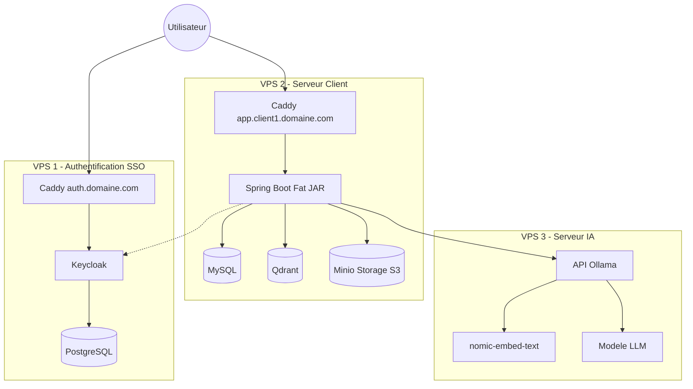

# Blueprint & Guide de Déploiement de l'Application (Fat JAR + VPS IA séparé + Minio)

Puisque votre application est un **Fat JAR**, et que vous souhaitez déporter **Ollama (LLM + nomic-embed-text)** sur un serveur séparé (très bonne pratique pour les performances GPU/CPU), nous avons 3 VPS spécialisés.
*Note : Le stockage de fichiers S3 (Minio) a été ajouté au VPS Client pour garantir une totale isolation des documents de chaque client.*

## 1. Schéma de Communication des VPS



### Explication du flux (Workflow) :
* L'**Utilisateur** accède à l'URL du client (ex: `app.client1.domaine.com`).
* Si l'utilisateur n'est pas connecté, Spring Boot (qui sert le front Angular) le redirige vers `auth.domaine.com` (VPS 1).
* Les données relationnelles et vectorielles sont stockées sur le **VPS 2** (MySQL + Qdrant).
* Les fichiers physiques (PDF, Word, images) sont stockés de manière isolée dans le **Minio** du VPS 2.
* Lorsque l'application a besoin de générer du texte ou vectoriser des documents (RAG), Spring Boot envoie une requête API au **VPS 3** qui gère `nomic-embed-text` et le LLM via Ollama.

---

## 2. Guide d'Installation (Docker Compose)

### VPS 1 : SSO Centralisé (Keycloak)
```yaml
version: '3.8'
services:
  caddy:
    image: lucaslorentz/caddy-docker-proxy:ci-alpine
    ports: ["80:80", "443:443"]
    environment:
      - CADDY_INGRESS_NETWORKS=keycloak_net
    networks:
      - keycloak_net
    volumes:
      - /var/run/docker.sock:/var/run/docker.sock:ro
      - caddy_data:/data
    restart: unless-stopped

  postgres:
    image: postgres:15
    environment:
      POSTGRES_DB: keycloak
      POSTGRES_USER: keycloak
      POSTGRES_PASSWORD: password_fort
    networks:
      - keycloak_net
    volumes:
      - postgres_data:/var/lib/postgresql/data
    restart: unless-stopped

  keycloak:
    image: quay.io/keycloak/keycloak:24.0.2
    command: start --proxy-headers xforwarded
    environment:
      KC_DB: postgres
      KC_DB_URL: jdbc:postgresql://postgres:5432/keycloak
      KC_DB_USERNAME: keycloak
      KC_DB_PASSWORD: password_fort
      KC_HOSTNAME: auth.votre-domaine.com
      KC_HTTP_ENABLED: "true"
      KEYCLOAK_ADMIN: admin
      KEYCLOAK_ADMIN_PASSWORD: admin_password_fort
    labels:
      caddy: auth.votre-domaine.com
      caddy.reverse_proxy: "{{upstreams 8080}}"
    networks:
      - keycloak_net
    depends_on:
      - postgres
    restart: unless-stopped

networks:
  keycloak_net:

volumes:
  postgres_data:
  caddy_data:
```

### VPS 2 : Serveur Client (Spring Boot + MySQL + Qdrant + Minio)
```yaml
version: '3.8'
services:
  caddy:
    image: lucaslorentz/caddy-docker-proxy:ci-alpine
    ports: ["80:80", "443:443"]
    environment:
      - CADDY_INGRESS_NETWORKS=client_net
    networks:
      - client_net
    volumes:
      - /var/run/docker.sock:/var/run/docker.sock:ro
      - caddy_data:/data
    restart: unless-stopped

  mysql:
    image: mysql:8.0
    environment:
      MYSQL_ROOT_PASSWORD: root_password
      MYSQL_DATABASE: si-legale
      MYSQL_USER: avo_user
      MYSQL_PASSWORD: avo_password
    volumes:
      - mysql_data:/var/lib/mysql
    networks:
      - client_net
    restart: unless-stopped

  qdrant:
    image: qdrant/qdrant:latest
    volumes:
      - qdrant_data:/qdrant/storage
    networks:
      - client_net
    restart: unless-stopped

  minio:
    image: minio/minio:latest
    command: server /data --console-address ":9001"
    environment:
      MINIO_ROOT_USER: minioadmin
      MINIO_ROOT_PASSWORD: minioadmin_password
    volumes:
      - minio_data:/data
    networks:
      - client_net
    restart: unless-stopped

  backend:
    image: votre-repo/avo-fatjar:latest 
    environment:
      - SPRING_DATASOURCE_URL=jdbc:mysql://mysql:3306/si-legale?serverTimezone=UTC
      - SPRING_DATASOURCE_USERNAME=avo_user
      - SPRING_DATASOURCE_PASSWORD=avo_password
      - QDRANT_HOST=qdrant
      - QDRANT_PORT=6334
      - MINIO_URL=http://minio:9000
      - MINIO_ACCESS_KEY=minioadmin
      - MINIO_SECRET_KEY=minioadmin_password
      - MINIO_BUCKET=avo-documents
      - OLLAMA_BASE_URL=http://IP_PUBLIQUE_OU_PRIVEE_VPS3:11434
      - KEYCLOAK_URL=https://auth.votre-domaine.com
    labels:
      caddy: app.client1.votre-domaine.com
      caddy.reverse_proxy: "{{upstreams 8080}}"
    depends_on:
      - mysql
      - qdrant
      - minio
    networks:
      - client_net
    restart: unless-stopped

networks:
  client_net:

volumes:
  caddy_data:
  mysql_data:
  qdrant_data:
  minio_data:
```

### VPS 3 : Serveur IA (Ollama)
```yaml
version: '3.8'
services:
  ollama:
    image: ollama/ollama:latest
    ports:
      - "11434:11434" # Attention: Securisez ce port via UFW (Firewall) !
    # deploy:
    #   resources: { reservations: { devices: [{ driver: nvidia, count: all, capabilities: [gpu] }] } }
    volumes:
      - ollama_data:/root/.ollama
    restart: unless-stopped

volumes:
  ollama_data:
```

**Remarque Sécurité :** Le port 11434 du VPS 3 ne doit pas être ouvert au public entier. Configurez le firewall (ex: `ufw allow from IP_VPS_2 to any port 11434`) pour protéger votre serveur IA.
