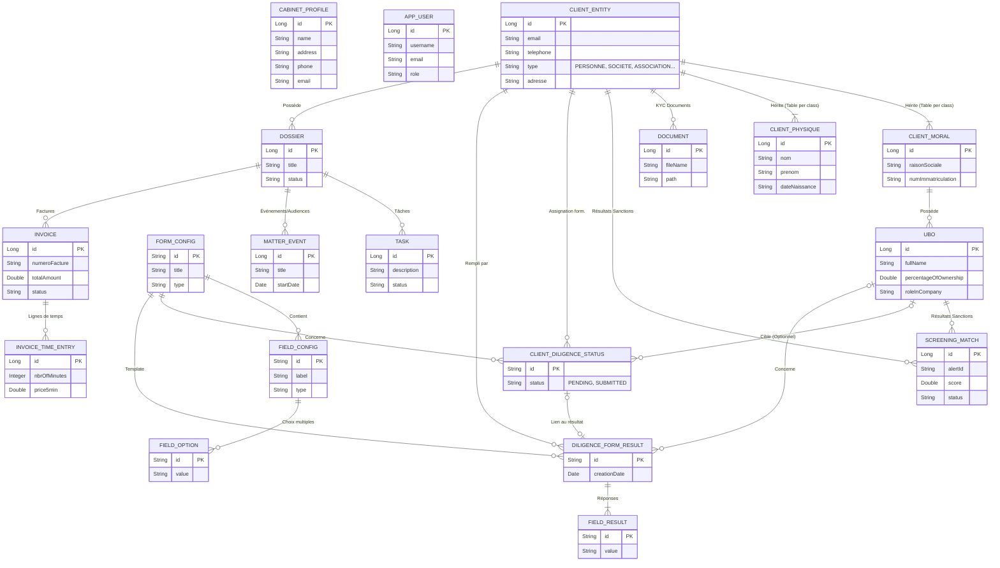

# Schéma de la Base de Données (Avo)

Voici le diagramme Entité-Relation (ER Diagram) représentant la structure principale de votre base de données, divisée par modules métier.

## Explication des Modules

1. **Clients & KYC** : Le `ClientEntity` est la table parente. Elle se décline en sous-types (Moral, Physique, etc.). Les sociétés (`ClientMoral`) peuvent avoir plusieurs bénéficiaires effectifs (`UBO`). Chacun peut être lié à des `ScreeningMatch` (alertes Yente/OpenSanctions).
2. **Due Diligence** : Les formulaires sont entièrement dynamiques (`FormConfig` contient des `FieldConfig`). Lorsqu'un cabinet assigne un formulaire à un client (ou à un UBO spécifique de ce client), un `ClientDiligenceStatus` est créé (statut PENDING). Une fois rempli, un `DiligenceFormResult` est généré, qui stocke une liste de `FieldResult` (les réponses réelles).
3. **Dossiers** : Un client a un ou plusieurs `Dossier`. Un dossier regroupe des événements, des tâches et des notes liés au cas légal.
4. **Facturation** : Chaque `Dossier` génère des `Invoice` (factures). Les factures contiennent des `InvoiceTimeEntry` (le temps passé par l'avocat facturé par tranches).
